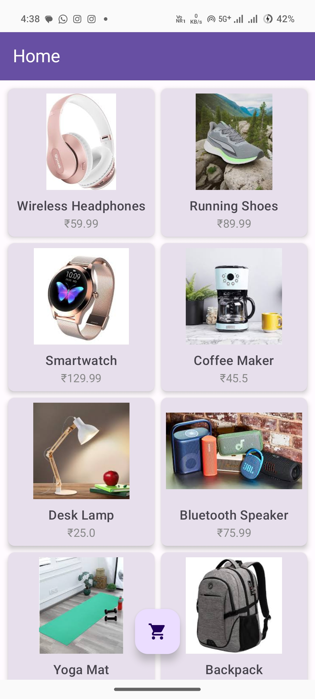
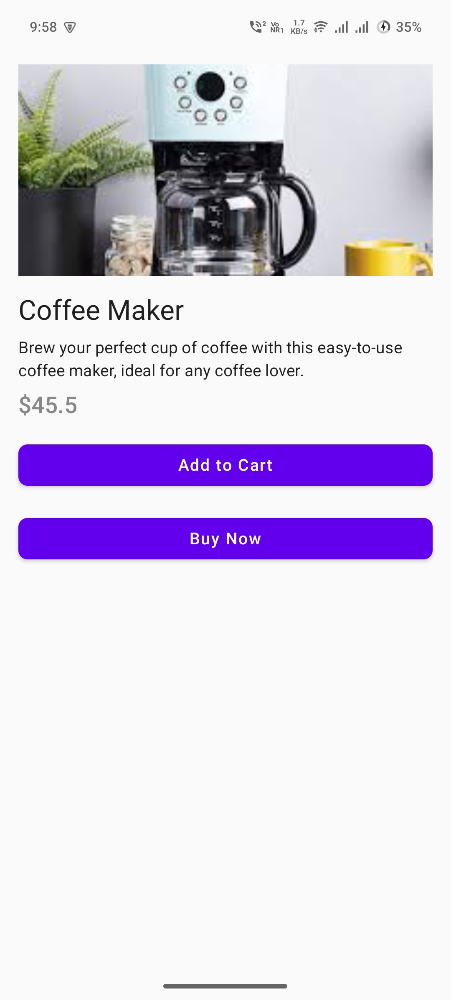
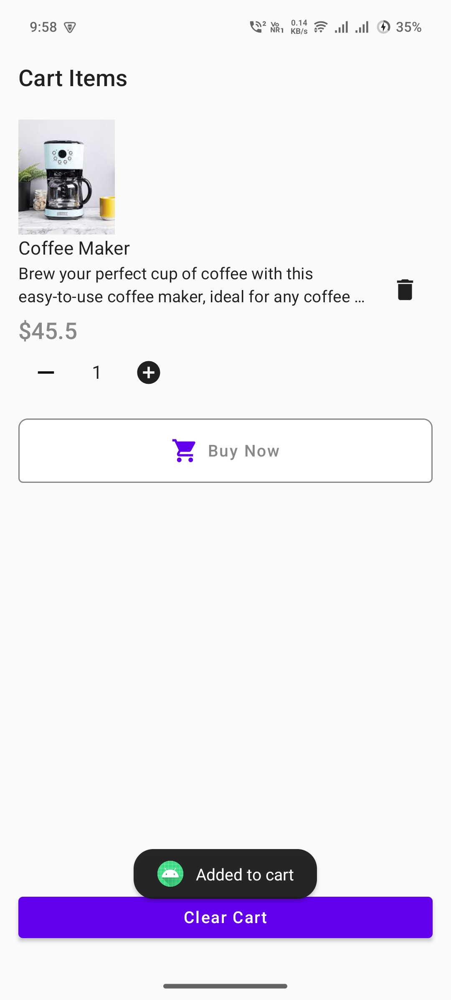

# WKart - E-Commerce App in Kotlin

A fully-featured **e-commerce mobile application** built with **Kotlin**, offering seamless product browsing, secure payments, and a modern shopping experience. This app is designed to meet the needs of online shoppers and business owners alike.

---

## 🌟 Features

- **Product Catalog:** Browse products with detailed descriptions and high-quality images.
- **Search and Filter:** Easily find what you’re looking for using advanced search and filters.
- **Shopping Cart:** Add, remove, and manage items in the cart.
- **Secure Payments:** Checkout with secure payment gateways.
- **Order Tracking:** Keep track of your orders with real-time updates.
- **User Accounts:** Register, log in, and manage your profile.
- **Wishlist:** Save favorite products for later.

---

## 🚀 Tech Stack

- **Kotlin**: The primary programming language.
- **Android Jetpack Components**: Used for modern and efficient app architecture.
- **Firebase/Backend Service**: For user authentication and database management.
- **Payment Gateway API**: To enable secure transactions.
- **Glide**: For efficient image loading.
- **MVVM Architecture**: Ensuring separation of concerns and easier scalability.

---

## 📱 Screenshots

| **Homepage** | **Product Details** | **Shopping Cart** |
|--------------|----------------------|-------------------|
|  |  |  |

---

## 🛠️ Installation and Setup

1. **Clone the Repository**:
   ```bash
   git clone https://github.com/your-username/ECommerceApp-Kotlin.git
   cd ECommerceApp-Kotlin
- 2.Open in Android Studio:
     - Open Android Studio and select "Open an Existing Project."
     - Navigate to the project folder and open it.
- 3.Set Up Dependencies:
     - Ensure all required dependencies are installed. Use Gradle sync.
- 4.Run the App:
     - Connect your device or use an emulator.
     - Click the "Run" button in Android Studio.

---

**👤 About the Author**:

- Name: Venkatraman.
- GitHub: venkatkrishna133.
- Email: developingccode@gmail.com.

---

**📄 License**:
This project is licensed under the MIT License. See the [LICENSE](./LICENSE.md) file for details.


